# Knowledge-Guided Graph Attention and Temporal Transformer Models for First-Trimester Pregnancy Loss Prediction in a Synthetic Longitudinal Ultrasound Cohort

Mr. A.V.M. Kumaran1, Dr. M. Sundara Rajan2

1Research Scholar, PG and Research Department of Computer Science, Government Arts College (Autonomous), Nandanam, Chennai - 600 035.  
2Associate Professor, PG and Research Department of Computer Science, Government Arts College (Autonomous), Nandanam, Chennai - 600 035.

Corresponding author: Mr. A.V.M. Kumaran, PG and Research Department of Computer Science, Government Arts College (Autonomous), Nandanam, Chennai - 600 035. Email: avmprofessor@gmail.com

## Abstract

Early pregnancy loss remains a common obstetric complication and continues to create substantial diagnostic uncertainty during the first trimester. Fetal heart rate, crown-rump length, yolk sac diameter, gestational sac measurements, gestational age, and maternal clinical factors serve as important indicators of embryonic viability, but their interpretation often depends on fixed thresholds, isolated measurements, and subjective clinical judgment. Existing prediction approaches frequently treat fetal heart rate as a static marker and do not fully represent the longitudinal, multimodal, and interdependent nature of early pregnancy development. This study proposes an explainable representation-learning framework for first-trimester pregnancy loss prediction using two complementary models: PREG-Net, a knowledge-guided graph attention network that explicitly models clinical relationships among ultrasound and maternal variables, and FETA-Transformer, a temporal attention model that learns gestational-age-dependent ultrasound trajectories from repeated scans. Public obstetric and fetal monitoring sources, including ultrasound literature, cardiotocography datasets, and fetal imaging resources, were first reviewed during data assembly. Because these sources did not provide a directly harmonized first-trimester patient-level dataset containing serial fetal heart rate, crown-rump length, gestational sac, yolk sac, maternal variables, and pregnancy-loss outcomes, the final analytic cohort was synthetically generated from clinically motivated growth curves, maternal risk-factor distributions, measurement noise, and missingness assumptions. The generated cohort contained 800 patients and 2408 scan records, including 188 pregnancy losses and 612 ongoing pregnancies, with 2-5 first-trimester ultrasound scans per patient. Models were evaluated using a fixed stratified train/validation/test split and five-fold stratified cross-validation, with bootstrap confidence intervals, exact McNemar tests, paired bootstrap AUROC-difference comparisons, and calibration analysis. On the fixed test split, PREG-Net achieved AUROC 0.9855, AUPRC 0.9568, accuracy 0.9508, sensitivity 0.9655, specificity 0.9462, and F1-score 0.9032. FETA-Transformer achieved AUROC 0.9896 and AUPRC 0.9728, while late-fusion ensembles achieved AUROC 0.9933. Tabular baselines were also highly competitive, with the MLP achieving the highest fixed-split AUROC of 0.9985, indicating that the main contribution of the proposed deep models lies in interpretable relational and temporal modeling rather than unconditional superiority in discrimination. PREG-Net explanations identified fetal heart rate as the most influential node family and highlighted clinically meaningful relationships involving yolk sac, gestational sac, prior-loss, and temporal continuity pathways. The results demonstrate the feasibility of graph attention and temporal attention models for first-trimester pregnancy loss prediction in a synthetic benchmark, while emphasizing the need for external clinical validation before clinical use.

**Keywords:** early pregnancy loss; fetal heart rate; longitudinal ultrasound; graph attention network; Transformer; explainable artificial intelligence; synthetic cohort; pregnancy risk prediction

## 1. Introduction

Early pregnancy represents a biologically sensitive phase that determines the viability of embryonic development and the eventual outcome of gestation. Pregnancy loss before completion of the first trimester affects a substantial proportion of clinically recognized pregnancies and remains one of the most common complications in obstetric practice [1]. Although many pregnancies progress normally, early loss can impose emotional, psychological, and clinical burdens on patients, families, and healthcare systems. Reliable early risk assessment is therefore an important priority in modern obstetrics because it can support counseling, follow-up planning, repeat ultrasound scheduling, and risk-stratified monitoring.

### Background

Ultrasound examination during early gestation provides the primary noninvasive method for assessing embryonic development and pregnancy viability. Among measurable indicators, fetal heart rate (FHR) has emerged as a central physiological marker because it reflects early cardiac activity and embryonic health. Abnormally low FHR values, delayed cardiac progression, or plateauing cardiac trajectories can indicate increased risk of pregnancy loss, especially when interpreted relative to gestational age. As a result, fetal heart rate assessment has become a routine component of first-trimester ultrasound evaluation.

Beyond fetal heart rate, several structural ultrasound parameters contribute important prognostic information. Crown-rump length (CRL) supports embryonic growth assessment and gestational dating. Gestational sac (GS) measurements reflect early gestational development and the surrounding support environment. Yolk sac diameter (YSD) provides additional information about early embryonic support and may become abnormal in pregnancies at risk. Deviations in these parameters may signal impaired embryonic development, especially when multiple measurements evolve abnormally over time.

Maternal factors further influence early gestational stability. Age, body mass index (BMI), parity, gravidity, previous pregnancy loss, conception method, and singleton status may interact with fetal growth dynamics and ultrasound findings. Therefore, early pregnancy loss prediction should not be reduced to one measurement or one time point. It requires a framework that combines longitudinal ultrasound trajectories with maternal context and the clinical relationships among variables.

Advances in medical imaging, public fetal monitoring datasets, electronic health records, and machine learning have created new opportunities for computational pregnancy-risk modeling. Data-driven methods can capture nonlinear interactions that are difficult to express with simple thresholds. However, the application of artificial intelligence to early pregnancy loss prediction remains uneven. Some approaches emphasize tabular feature engineering, some focus on image or fetal monitoring datasets, and many provide limited patient-specific interpretability. The present study builds on the earlier explainable machine learning framework for longitudinal ultrasound data [1] and extends it from hand-crafted time-aware features toward graph-based and temporal representation learning.

### Challenges in Existing Approaches

Despite the recognized prognostic value of early ultrasound markers, several challenges persist in current research and clinical practice. First, many studies rely on static threshold-based interpretations of fetal heart rate or individual ultrasound measurements. Although fixed cutoffs are simple and clinically familiar, they cannot fully account for physiological variability across gestational age, patient-specific growth patterns, or the rapid developmental changes that occur during the first trimester.

Second, a large proportion of prediction approaches focus on single predictors or treat variables as independent tabular fields. FHR, CRL, GS, YSD, gestational age, and maternal risk factors are clinically related, but conventional feature tables do not explicitly represent these relationships. This can limit interpretability and may obscure the biological pathways through which abnormal cardiac activity, impaired growth, sac development, yolk sac behavior, and maternal history jointly influence pregnancy viability.

Third, most existing analyses simplify longitudinal information into hand-crafted summaries such as latest value, mean value, slope, or week-specific thresholds. Such features can be useful, but they impose predefined assumptions about which temporal patterns matter. Subtle deviations in cardiac progression, embryonic growth, gestational sac development, or yolk sac behavior may be distributed across multiple scans and may not be adequately captured by a small set of engineered descriptors.

Fourth, dataset availability remains a methodological constraint. Public obstetric resources include ultrasound literature, cardiotocography data, fetal monitoring archives, and imaging datasets, but these sources are not usually harmonized into a single first-trimester patient-level dataset with repeated FHR, CRL, GS, YSD, maternal variables, and pregnancy-loss outcomes. This limits reproducibility and makes it difficult to evaluate models that require both longitudinal ultrasound data and maternal clinical context.

Finally, many artificial intelligence models remain difficult to explain. In obstetric decision support, interpretability is essential because clinicians must understand which variables and relationships influenced a risk estimate. Black-box predictions may reduce trust and limit practical adoption, especially when counseling patients about uncertain early pregnancy outcomes.

### Problem Statement

Given these challenges, current approaches to early pregnancy loss prediction have limitations in temporal modeling, multimodal integration, and clinical interpretability. Continued reliance on isolated measurements, fixed cutoffs, and purely tabular feature representations can lead to incomplete risk assessment. The lack of an integrated framework for modeling gestational progression and clinical relationships constrains the ability to identify high-risk pregnancies in a transparent and reproducible manner.

### Research Gap

A critical gap exists at the intersection of multimodal ultrasound assessment, longitudinal sequence modeling, and explainable clinical relationship modeling for early pregnancy loss prediction. Although FHR, CRL, GS, YSD, gestational age, and maternal factors individually demonstrate prognostic relevance, few approaches explicitly combine these variables within a framework that captures both temporal progression and physiological relationships. Existing temporal models may learn scan-level patterns but often provide limited relationship-level explanations. Existing explainable tabular models may provide feature attribution but do not naturally represent clinical variables as an interdependent system.

There remains no widely adopted approach that compares knowledge-guided graph attention, temporal attention, and late fusion for first-trimester pregnancy loss prediction while maintaining transparent evaluation against strong tabular baselines. Addressing this gap requires a model-development framework that balances predictive performance, biological plausibility, and interpretability, while clearly separating synthetic-cohort feasibility evidence from claims of clinical validity.

### Objective of the Study

The primary objective of this study is to develop and evaluate PREG-Net, a knowledge-guided graph attention model for first-trimester pregnancy loss prediction. PREG-Net represents ultrasound and maternal variables as graph nodes and uses clinically motivated edges to model relationships among fetal heart rate, embryonic growth, gestational sac development, yolk sac behavior, maternal risk factors, and temporal continuity. The secondary objective is to evaluate FETA-Transformer as a temporal comparison model that learns gestational-age-dependent ultrasound trajectories from variable-length scan sequences. A further objective is to assess whether late-fusion ensembles can combine graph-based and temporal representations to improve predictive performance.

Public obstetric and fetal monitoring sources were reviewed and targeted during data assembly, but the final experiments used a synthetic first-trimester cohort because the available public sources were not directly harmonized for the required patient-level longitudinal ultrasound and outcome structure. The synthetic cohort was generated from clinically motivated growth curves, maternal risk-factor distributions, measurement noise, and missingness assumptions. This design supports controlled model development and reproducible evaluation, while requiring cautious interpretation because it does not establish clinical validity.

### Contributions

This study makes the following contributions. First, it presents PREG-Net as a knowledge-guided graph attention framework for interpretable early pregnancy loss prediction. Second, it evaluates FETA-Transformer as a temporal attention model for learning gestational-age-dependent ultrasound patterns. Third, it compares individual graph and temporal models with simple and learned late-fusion ensembles. Fourth, it benchmarks these research models against strong engineered tabular baselines. Fifth, it reports fixed-split testing, five-fold stratified cross-validation, bootstrap confidence intervals, paired statistical comparisons, calibration metrics, and explainability outputs. Finally, it provides a transparent discussion of synthetic-data limitations, baseline strength, pending ablation experiments, and the need for external clinical validation before deployment-oriented claims.

## 2. Related Work

Prior research on early pregnancy outcome prediction has increasingly combined ultrasound measurements, maternal clinical variables, and machine learning. Ultrasound-based biometric extraction models have been used to measure gestational sac area, yolk sac diameter, crown-rump length, and fetal heart rate from early pregnancy imaging, followed by ensemble models for pregnancy loss prediction [2]. Week-specific models in recurrent pregnancy loss have shown that predictive factors vary with gestational age and that risk modeling improves as additional biometric signals become available [3].

Radiomics and multimodal ultrasound studies have expanded beyond conventional measurements by extracting image-derived features from transvaginal ultrasound, shear wave elastography, or other modalities [4,5]. Other work has combined radiomic and clinical features for miscarriage prediction and has emphasized the value of validation across independent sites [6]. Preconception models for recurrent pregnancy loss and machine learning models for miscarriage management have further shown the broader applicability of predictive modeling in reproductive medicine [7,8].

Despite this progress, several gaps remain. First, many studies rely on static features, threshold rules, or engineered summaries rather than directly modeling longitudinal patterns. Second, even when machine learning models perform well, their reasoning may remain difficult to align with clinical mechanisms. Third, models that combine ultrasound and maternal data often treat variables as independent columns, even though early pregnancy biology is relational. FHR, CRL, GS, YSD, maternal age, previous loss, and other factors are connected through physiological pathways rather than isolated statistical predictors.

Graph attention networks provide a natural framework for relational modeling because they propagate information across nodes and can expose node- and edge-level importance [9]. Transformers provide a complementary framework for sequence modeling, using attention to learn which time points or tokens are most predictive [10]. This study applies these two ideas to first-trimester pregnancy loss prediction: PREG-Net emphasizes biological relationships, while FETA-Transformer emphasizes temporal progression.

## 3. Materials and Methods

### 3.1 Study Design

This was a model-development and evaluation study using a synthetic first-trimester longitudinal ultrasound cohort. The goal was not to claim clinical validity, but to test whether knowledge-guided graph attention and temporal Transformer modeling can represent the clinical structure described in the research design. PREG-Net was treated as the primary model because it offers explicit node- and edge-level interpretability. FETA-Transformer was treated as the temporal comparison model. Simple and learned ensembles were evaluated to measure whether the two neural representations were complementary.

### 3.2 Synthetic Cohort Construction

The cohort was generated using `synthetic_generator_v2.py` with seed 42. The final dataset contained 800 patients and 2408 ultrasound scan records. There were 612 ongoing pregnancies and 188 pregnancy losses, corresponding to a 23.5 percent loss rate. Each patient had 2-5 first-trimester ultrasound scans.

Patient-level variables included maternal age, BMI, parity, gravidity, previous pregnancy loss, conception method, singleton status, and outcome label. Longitudinal ultrasound variables included FHR, CRL, GS, and YSD. Synthetic trajectories were generated from biologically motivated first-trimester curves with patient-level latent factors for growth, cardiac function, placentation, and measurement noise. Pregnancy-loss cases were modeled with overlapping but shifted latent-factor distributions, allowing abnormal or deteriorating trajectories without making the task deterministic.

Clinically plausible missingness was introduced as a function of gestational age and outcome. FHR had higher missingness before 6.5 weeks, CRL was sometimes missing very early, GS was rarely missing, and YSD was more likely to be missing very early or after 11 weeks. Missing ultrasound values were interpolated within patient, then back-filled and forward-filled, with residual missing values filled by feature medians. The saved generated dataset had no remaining missing ultrasound values.

**Table 1. Synthetic cohort characteristics by outcome.**

| Characteristic | Overall | Ongoing | Loss |
| --- | --- | --- | --- |
| Patients, n | 800 | 612 | 188 |
| Loss rate, % | 23.5 | 0.0 | 100.0 |
| Scans per patient | 3.01 +/- 0.82 | 3.04 +/- 0.84 | 2.93 +/- 0.75 |
| First GA, weeks | 6.50 +/- 0.67 | 6.47 +/- 0.67 | 6.58 +/- 0.69 |
| Latest GA, weeks | 10.52 +/- 1.82 | 10.52 +/- 1.83 | 10.51 +/- 1.77 |
| Maternal age, years | 30.22 +/- 4.80 | 29.10 +/- 4.18 | 33.86 +/- 4.90 |
| BMI | 25.17 +/- 4.35 | 24.67 +/- 4.03 | 26.83 +/- 4.91 |
| Parity | 0.55 +/- 0.71 | 0.54 +/- 0.69 | 0.57 +/- 0.76 |
| Gravidity | 1.40 +/- 0.79 | 1.33 +/- 0.75 | 1.61 +/- 0.88 |
| Previous loss, % | 19.2 | 12.3 | 42.0 |
| IVF conception, % | 12.4 | 9.8 | 20.7 |
| Singleton, % | 100.0 | 100.0 | 100.0 |

### 3.3 Preprocessing and Split Strategy

Each patient was represented as a fixed-length sequence of up to five scans. For FETA-Transformer, each record contained temporal ultrasound features with shape `(T, 4)`, gestational ages with shape `(T,)`, a temporal mask indicating real versus padded scans, maternal features with shape `(7,)`, and a binary outcome label. For PREG-Net, the same patient batch was converted into graph tensors containing temporal ultrasound nodes and static maternal nodes.

Single-split experiments used a stratified 70/15/15 train/validation/test split with seed 42. The fixed test set contained 122 patients. Training-only normalization statistics were computed for continuous ultrasound and maternal variables and then applied to validation and test data. Binary maternal features were kept in their original 0/1 form. Five-fold cross-validation used stratified folds, with validation subsets drawn from each training fold.

### 3.4 PREG-Net

PREG-Net represents each patient as a knowledge-guided graph. Temporal nodes encode FHR, CRL, GS, and YSD at each scan time point. Static maternal nodes encode age, BMI, parity, gravidity, previous pregnancy loss, conception method, and singleton status. Edges encode physiological relationships and temporal continuity.

Intra-time ultrasound edges include relationships such as FHR-to-CRL, YSD-to-GS, CRL-to-GS, and FHR-to-YSD, with bidirectional counterparts where implemented. Maternal-to-ultrasound edges connect maternal risk factors to selected ultrasound nodes, including age, BMI, previous loss, gravidity, parity, and conception method. Temporal edges connect the same ultrasound variable across consecutive scans in both directions.

Each node is encoded using a scalar value projection and node-type embedding. Stacked graph attention layers perform message passing over the knowledge-guided graph. An attention readout produces a patient-level representation and node-importance scores. A binary classification head outputs the pregnancy-loss logit. PREG-Net explainability outputs include node importance, edge attention averaged across layers and heads, clinical edge-group summaries, and patient-specific graph visualizations.

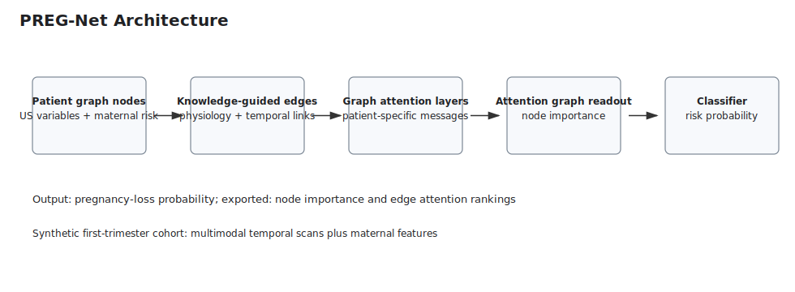

*Figure 1. PREG-Net architecture. Temporal ultrasound nodes and maternal nodes are connected through knowledge-guided and temporal graph edges before graph attention readout and binary classification.*

### 3.5 FETA-Transformer

FETA-Transformer models each patient as a variable-length longitudinal ultrasound sequence. Each ultrasound modality is projected separately into a shared model dimension. Continuous positional encoding uses actual gestational age rather than scan index, allowing the model to represent irregular scan timing. Transformer encoder layers model interactions across scan tokens. Attention-based temporal pooling produces scan-level attention weights that can be summarized by gestational week.

Static maternal features condition the temporal representation through a maternal attention module before classification. In the current trained implementation, maternal cross-attention is applied to the pooled temporal representation. Therefore, exported maternal-to-time maps should be interpreted as post-hoc aids derived from trained maternal queries and temporal keys, not as evidence from a fully retrained maternal-to-token cross-attention architecture.

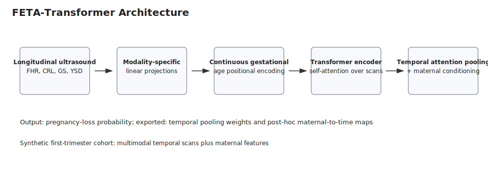

*Figure 2. FETA-Transformer architecture. The model uses modality-specific projections, continuous gestational-age positional encoding, Transformer encoding, attention pooling, maternal conditioning, and binary classification.*

### 3.6 Late-Fusion Ensembles

Two late-fusion ensembles combined trained PREG-Net and FETA-Transformer predictions. The simple ensemble averaged component logits. The learned ensemble trained a linear fusion layer over the two component logits, initialized to equal weighting. The learned-fusion run reported effective fusion weights of approximately 0.542 for FETA-Transformer and 0.481 for PREG-Net.

### 3.7 Baseline Models

Baseline models used engineered tabular features derived from the same patient splits. Features included scan count, first gestational age, latest gestational age, gestational-age span, maternal variables, and for each ultrasound variable the latest value, mean value, and slope over gestational age. Baselines included Torch logistic regression, Torch MLP, sklearn logistic regression, Random Forest, HistGradientBoosting, and XGBoost.

### 3.8 Training

Deep models used weighted binary cross-entropy, AdamW optimization, cosine warm restarts, validation AUROC monitoring, early stopping, and checkpointing. The standard configuration used batch size 32, learning rate 0.001, weight decay 0.0001, and patience 15. PREG-Net used hidden dimension 64, two graph attention layers, four attention heads, and dropout 0.2. FETA-Transformer used model dimension 64, four heads, two Transformer layers, feed-forward dimension 128, and dropout 0.2.

**Table 2. Main model hyperparameters.**

| Model | Epochs | Batch size | Learning rate | Weight decay | Patience | Architecture | Fusion |
| --- | --- | --- | --- | --- | --- | --- | --- |
| PREG-Net | 80 | 32 | 0.001 | 0.0001 | 15 | hidden_dim=64, GAT layers=2, heads=4, dropout=0.2 |  |
| FETA-Transformer | 80 | 32 | 0.001 | 0.0001 | 15 | d_model=64, heads=4, layers=2, d_ff=128, dropout=0.2 |  |
| Ensemble | 80 | 32 | 0.001 | 0.0001 | 15 | late fusion of trained FETA-Transformer and PREG-Net | average |
| Learned Ensemble | 80 | 32 | 0.001 | 0.0001 | 15 | late fusion of trained FETA-Transformer and PREG-Net | learned |
| Torch Logistic Regression / MLP | 300 | full batch | 0.001 | 0.0001 | 50 | 23 engineered tabular features; MLP hidden 64/32 |  |
| Sklearn / tree baselines |  |  |  |  |  | LogisticRegression, RandomForest, HistGradientBoosting, XGBoost on engineered tabular features |  |

### 3.9 Evaluation and Statistical Analysis

Primary metrics were AUROC, AUPRC, accuracy, sensitivity, specificity, F1-score, precision, and recall. Fixed-split model comparison files were saved under `results/model_comparison.*`. Cross-validation summaries were saved under `results/cross_validation`.

Bootstrap 95 percent confidence intervals were computed from fixed test predictions using 2000 bootstrap resamples. Exact McNemar tests compared paired classification correctness. Paired bootstrap AUROC-difference comparisons were used as a documented alternative to DeLong testing. Calibration was assessed by Brier score, expected calibration error, maximum calibration error, and calibration-curve bins.

## 4. Results

### 4.1 Fixed Test Split Performance

All models achieved high discrimination on the fixed synthetic test split. PREG-Net, the primary interpretable graph model, achieved AUROC 0.9855 and AUPRC 0.9568. FETA-Transformer achieved slightly higher discrimination, with AUROC 0.9896 and AUPRC 0.9728. Both simple and learned ensembles achieved AUROC 0.9933, supporting the hypothesis that graph and temporal representations provide partially complementary signal.

However, tabular baselines were also very strong. The MLP achieved the highest fixed-split AUROC and AUPRC, with AUROC 0.9985 and AUPRC 0.9952. Sklearn logistic regression also performed strongly, with AUROC 0.9963 and AUPRC 0.9878. This result is important because it shows that the synthetic generator produces structured tabular signal that can be captured by engineered features. Therefore, the neural models should not be presented as universally superior in raw discrimination. Their contribution is better framed around interpretable graph reasoning, temporal representation learning, and model comparison.

**Table 3. Fixed test split model comparison.**

| Model | AUROC | AUPRC | Accuracy | Sensitivity | Specificity | F1 | Precision |
| --- | --- | --- | --- | --- | --- | --- | --- |
| MLP | 0.9985 | 0.9952 | 0.9836 | 1.0000 | 0.9785 | 0.9667 | 0.9355 |
| Sklearn Logistic Regression | 0.9963 | 0.9878 | 0.9672 | 0.9655 | 0.9677 | 0.9333 | 0.9032 |
| Ensemble | 0.9933 | 0.9806 | 0.9426 | 0.9655 | 0.9355 | 0.8889 | 0.8235 |
| Learned Ensemble | 0.9933 | 0.9807 | 0.9426 | 0.9655 | 0.9355 | 0.8889 | 0.8235 |
| HistGradientBoosting | 0.9933 | 0.9784 | 0.9590 | 0.9310 | 0.9677 | 0.9153 | 0.9000 |
| XGBoost | 0.9911 | 0.9729 | 0.9508 | 0.9655 | 0.9462 | 0.9032 | 0.8485 |
| Random Forest | 0.9909 | 0.9705 | 0.9508 | 0.9310 | 0.9570 | 0.9000 | 0.8710 |
| FETA-Transformer | 0.9896 | 0.9728 | 0.9344 | 0.8966 | 0.9462 | 0.8667 | 0.8387 |
| Logistic Regression | 0.9889 | 0.9661 | 0.9016 | 0.9655 | 0.8817 | 0.8235 | 0.7179 |
| PREG-Net | 0.9855 | 0.9568 | 0.9508 | 0.9655 | 0.9462 | 0.9032 | 0.8485 |

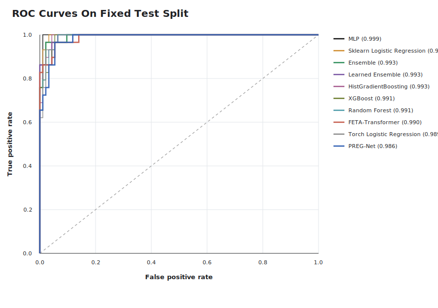

*Figure 3. Receiver operating characteristic curves for evaluated models on the fixed test split.*

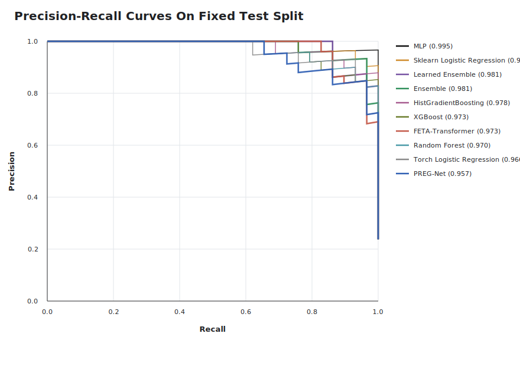

*Figure 4. Precision-recall curves for evaluated models on the fixed test split.*

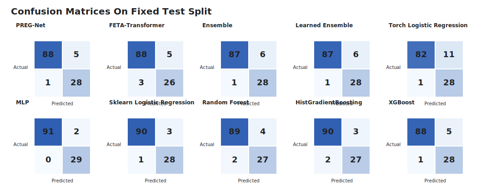

*Figure 5. Confusion matrices for evaluated models on the fixed test split.*

### 4.2 Bootstrap Confidence Intervals

Bootstrap confidence intervals confirmed high but overlapping performance among the neural models. PREG-Net achieved AUROC 0.9855 with 95 percent CI [0.9663, 0.9973], while FETA-Transformer achieved AUROC 0.9896 with 95 percent CI [0.9732, 0.9993]. The learned ensemble achieved AUROC 0.9933 with 95 percent CI [0.9824, 0.9997]. The MLP baseline achieved AUROC 0.9985 with 95 percent CI [0.9942, 1.0000].

**Table 4. Bootstrap 95 percent confidence intervals for selected models.**

| Model | AUROC | AUPRC | Accuracy | Sensitivity | Specificity | F1 |
| --- | --- | --- | --- | --- | --- | --- |
| PREG-Net | 0.9855 [0.9663, 0.9973] | 0.9568 [0.8909, 0.9914] | 0.9508 [0.9098, 0.9836] | 0.9655 [0.8800, 1.0000] | 0.9462 [0.8942, 0.9886] | 0.9032 [0.8108, 0.9697] |
| FETA-Transformer | 0.9896 [0.9732, 0.9993] | 0.9728 [0.9295, 0.9978] | 0.9344 [0.8852, 0.9754] | 0.8966 [0.7742, 1.0000] | 0.9462 [0.8961, 0.9890] | 0.8667 [0.7556, 0.9492] |
| Ensemble | 0.9933 [0.9810, 1.0000] | 0.9806 [0.9408, 1.0000] | 0.9426 [0.8934, 0.9836] | 0.9655 [0.8800, 1.0000] | 0.9355 [0.8788, 0.9789] | 0.8889 [0.7937, 0.9620] |
| Learned Ensemble | 0.9933 [0.9824, 0.9997] | 0.9807 [0.9469, 0.9991] | 0.9426 [0.9016, 0.9836] | 0.9655 [0.8800, 1.0000] | 0.9355 [0.8830, 0.9794] | 0.8889 [0.7931, 0.9630] |
| MLP | 0.9985 [0.9942, 1.0000] | 0.9952 [0.9793, 1.0000] | 0.9836 [0.9590, 1.0000] | 1.0000 [1.0000, 1.0000] | 0.9785 [0.9468, 1.0000] | 0.9667 [0.9123, 1.0000] |
| Sklearn Logistic Regression | 0.9963 [0.9881, 1.0000] | 0.9878 [0.9592, 1.0000] | 0.9672 [0.9344, 0.9918] | 0.9655 [0.8800, 1.0000] | 0.9677 [0.9278, 1.0000] | 0.9333 [0.8571, 0.9855] |

### 4.3 Cross-Validation

Five-fold stratified cross-validation confirmed high discrimination across models. Sklearn logistic regression had the highest mean test AUROC at 0.9930 +/- 0.0042. Among the research deep models, the learned ensemble had mean AUROC 0.9873 +/- 0.0146 and the highest mean F1-score at 0.9306 +/- 0.0181. FETA-Transformer achieved mean AUROC 0.9859 +/- 0.0115. PREG-Net achieved mean AUROC 0.9761 +/- 0.0116.

**Table 5. Five-fold cross-validation test performance.**

| Model | AUROC | AUPRC | Accuracy | Sensitivity | Specificity | F1 |
| --- | --- | --- | --- | --- | --- | --- |
| sklearn_logistic_regression | 0.9930 +/- 0.0042 | 0.9806 +/- 0.0116 | 0.9600 +/- 0.0224 | 0.9415 +/- 0.0223 | 0.9657 +/- 0.0275 | 0.9185 +/- 0.0425 |
| hist_gradient_boosting | 0.9889 +/- 0.0117 | 0.9713 +/- 0.0272 | 0.9600 +/- 0.0163 | 0.9043 +/- 0.0556 | 0.9771 +/- 0.0158 | 0.9138 +/- 0.0354 |
| random_forest | 0.9889 +/- 0.0103 | 0.9699 +/- 0.0272 | 0.9625 +/- 0.0193 | 0.9148 +/- 0.0347 | 0.9771 +/- 0.0158 | 0.9200 +/- 0.0397 |
| xgboost | 0.9885 +/- 0.0119 | 0.9732 +/- 0.0255 | 0.9650 +/- 0.0180 | 0.9149 +/- 0.0344 | 0.9804 +/- 0.0170 | 0.9252 +/- 0.0373 |
| learned_ensemble | 0.9873 +/- 0.0146 | 0.9733 +/- 0.0203 | 0.9675 +/- 0.0081 | 0.9307 +/- 0.0411 | 0.9788 +/- 0.0109 | 0.9306 +/- 0.0181 |
| ensemble | 0.9865 +/- 0.0133 | 0.9735 +/- 0.0156 | 0.9337 +/- 0.0387 | 0.9413 +/- 0.0518 | 0.9314 +/- 0.0628 | 0.8747 +/- 0.0612 |
| torch_mlp | 0.9864 +/- 0.0104 | 0.9694 +/- 0.0170 | 0.9575 +/- 0.0223 | 0.9361 +/- 0.0238 | 0.9640 +/- 0.0250 | 0.9130 +/- 0.0424 |
| feta | 0.9859 +/- 0.0115 | 0.9685 +/- 0.0227 | 0.9587 +/- 0.0144 | 0.9201 +/- 0.0425 | 0.9706 +/- 0.0222 | 0.9134 +/- 0.0288 |
| preg | 0.9761 +/- 0.0116 | 0.9374 +/- 0.0264 | 0.9200 +/- 0.0291 | 0.9144 +/- 0.0587 | 0.9215 +/- 0.0422 | 0.8448 +/- 0.0449 |

### 4.4 Pairwise Statistical Comparisons

Exact McNemar tests showed the strongest paired classification differences between Torch logistic regression and MLP (exact p = 0.0020), Torch logistic regression and sklearn logistic regression (p = 0.0215), and FETA-Transformer and MLP (p = 0.0312). For PREG-Net versus FETA-Transformer, McNemar testing did not show a significant paired classification difference (p = 0.7266). PREG-Net versus ensemble and PREG-Net versus learned ensemble were also not significant by exact McNemar testing (p = 1.0000).

Paired bootstrap AUROC-difference analysis showed that PREG-Net had lower AUROC than MLP by -0.0130, 95 percent CI [-0.0297, -0.0023], bootstrap p = 0.0120. FETA-Transformer also had lower AUROC than MLP by -0.0089, 95 percent CI [-0.0232, -0.0007], p = 0.0290. PREG-Net was lower than sklearn logistic regression by -0.0108, 95 percent CI [-0.0273, -0.0007], p = 0.0370. The AUROC difference between PREG-Net and FETA-Transformer was not significant by bootstrap comparison (difference -0.0041, 95 percent CI [-0.0208, 0.0109], p = 0.6010).

### 4.5 Calibration

Calibration metrics varied across models. The MLP had the lowest Brier score at 0.0162 and expected calibration error (ECE) 0.0200. Sklearn logistic regression had Brier score 0.0209 and ECE 0.0327. PREG-Net had Brier score 0.0502 and ECE 0.0541, while FETA-Transformer had Brier score 0.0454 and ECE 0.0471. These results indicate that although the neural models discriminated well, calibration should be further optimized before any clinical risk-estimation use.

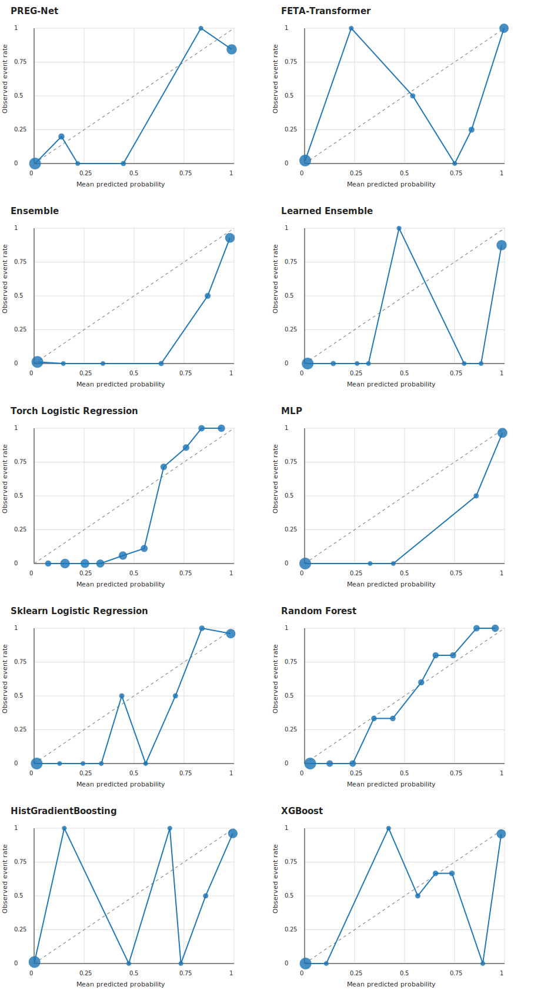

*Figure 6. Calibration curves for evaluated models on the fixed test split.*

### 4.6 Explainability

PREG-Net node importance was highest for FHR, followed by YSD and selected maternal/context features. This aligns with clinical expectations that cardiac activity and early developmental support are central to viability assessment. The exported importance rankings also identified singleton status and gravidity, although singleton status was constant in this synthetic cohort and should therefore be interpreted cautiously as a model artifact or contextual node effect rather than as real clinical evidence.

**Table 6. PREG-Net node importance summary.**

| Rank | Node Feature | Family | Mean Importance |
| ---: | --- | --- | ---: |
| 1 | FHR | temporal | 0.2283 |
| 2 | YSD | temporal | 0.0613 |
| 3 | singleton | maternal | 0.0400 |
| 4 | gravidity | maternal | 0.0301 |
| 5 | GS | temporal | 0.0189 |
| 6 | conception_ivf | maternal | 0.0036 |
| 7 | previous_loss | maternal | 0.0032 |
| 8 | bmi | maternal | 0.0030 |
| 9 | CRL | temporal | 0.0029 |
| 10 | age | maternal | 0.0022 |
| 11 | parity | maternal | 0.0014 |

PREG-Net edge attention highlighted both clinically motivated relationships and additional implementation edges. High-attention relationships included CRL-to-GS, FHR-to-YSD, temporal same-variable edges, previous-loss-to-YSD, and FHR-to-CRL. These patterns suggest that the graph model used both cross-sectional physiological relationships and longitudinal continuity.

**Table 7. PREG-Net edge attention summary.**

| Rank | Relationship | Clinical Group | Mean Attention |
| ---: | --- | --- | ---: |
| 1 | CRL_to_GS | additional_code_edge | 0.2167 |
| 2 | FHR_to_YSD | additional_code_edge | 0.1952 |
| 3 | CRL_temporal_backward | temporal_same_variable | 0.1680 |
| 4 | GS_to_YSD | additional_code_edge | 0.1679 |
| 5 | GS_temporal_backward | temporal_same_variable | 0.1660 |
| 6 | previous_loss_to_YSD | primary_research_rationale | 0.1626 |
| 7 | CRL_to_FHR | additional_code_edge | 0.1602 |
| 8 | age_to_YSD | additional_code_edge | 0.1599 |
| 9 | YSD_temporal_backward | temporal_same_variable | 0.1550 |
| 10 | FHR_temporal_forward | temporal_same_variable | 0.1416 |
| 11 | FHR_to_CRL | primary_research_rationale | 0.1382 |
| 12 | CRL_temporal_forward | temporal_same_variable | 0.1380 |

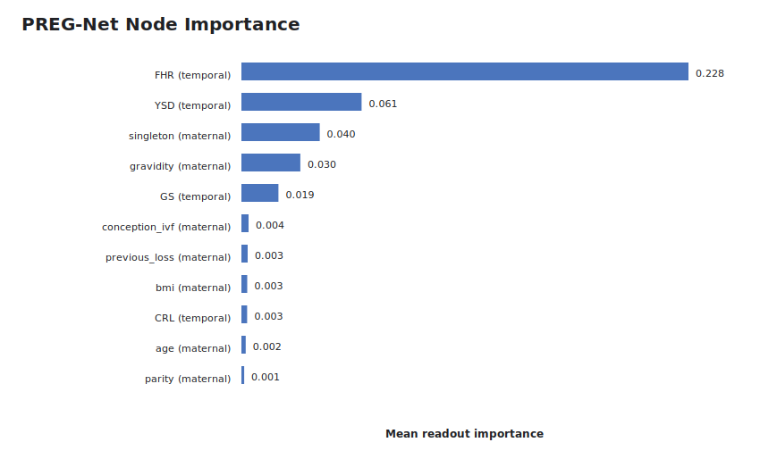

*Figure 7. PREG-Net node importance ranking on the fixed test split.*

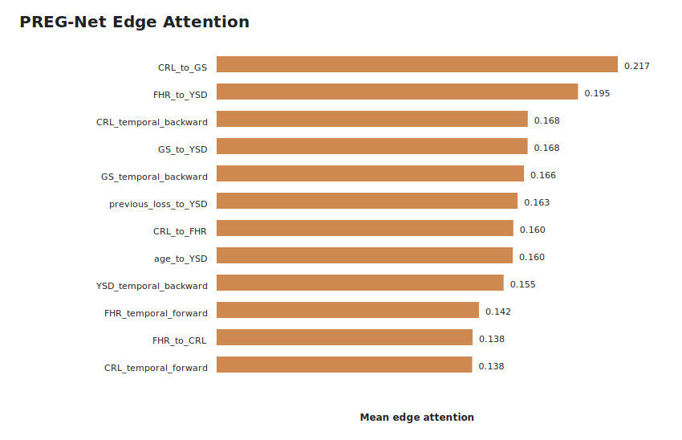

*Figure 8. PREG-Net edge attention ranking on the fixed test split.*

FETA-Transformer temporal attention concentrated on later first-trimester windows in many patients. Mean temporal attention for ongoing pregnancies increased at weeks 8-12, and loss cases also showed higher attention in later observed weeks. This pattern is plausible because later scans contain more developed cardiac and growth information, but it should not be interpreted as proof that earlier scans are unimportant. Attention weights are model explanations, not causal estimates.

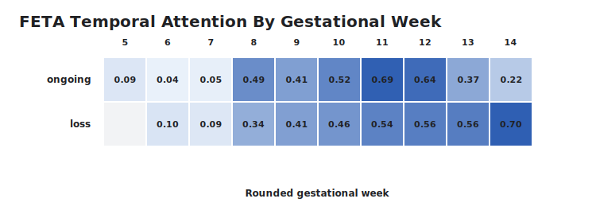

*Figure 9. FETA-Transformer temporal attention summarized by gestational week and outcome.*

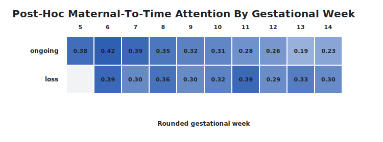

*Figure 10. Post-hoc maternal-to-time attention map. These maps are interpretability aids, not outputs from a fully retrained maternal-to-token cross-attention architecture.*

### 4.7 Case Studies

Four case studies were exported for qualitative review: one true positive, one true negative, one false positive, and one false negative. The true positive case P00548 had label 1, PREG-Net probability 1.0000, and FETA-Transformer probability 0.9996. This patient had advanced maternal age, previous loss, IVF conception, and a scan trajectory that received high PREG-Net attention on YSD and FHR nodes. FETA-Transformer assigned most temporal attention to the latest scan at 11.2 weeks.

The true negative case P00320 had label 0, PREG-Net probability 0.0000, and FETA-Transformer probability 0.0005. Its top PREG-Net node was FHR at the second scan, and FETA-Transformer assigned highest attention to the later scan at 9.1 weeks.

The false positive case P00089 had label 0 but high predicted risk from both neural models. The case included previous loss, elevated BMI, and early low FHR followed by later improvement, suggesting that risk-like early features may have dominated the model's interpretation. The false negative case P00099 had label 1, PREG-Net probability 0.1369, and FETA-Transformer probability 0.9766. This discrepancy illustrates that graph and temporal models may fail or succeed on different patient patterns.

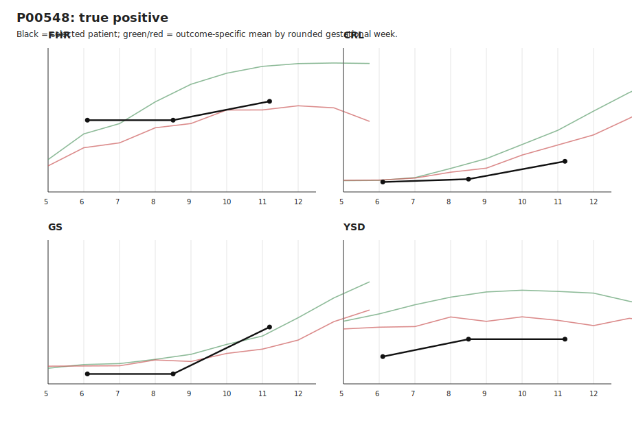

*Figure 11. True positive case trajectory.*

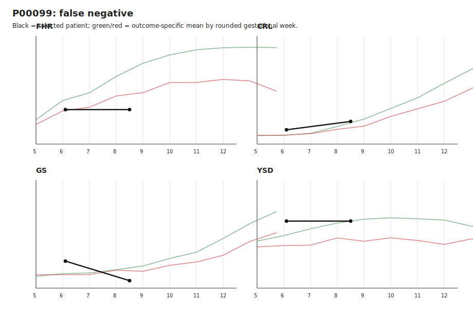

*Figure 12. False negative case trajectory.*

## 5. Discussion

This study evaluated two complementary neural approaches for first-trimester pregnancy loss prediction in a synthetic longitudinal ultrasound cohort. PREG-Net was designed to model clinical interdependencies through a knowledge-guided graph, while FETA-Transformer was designed to learn temporal patterns over irregular scan sequences. Both models achieved high discrimination, and late-fusion ensembles improved AUROC relative to either neural model alone on the fixed test split.

The main methodological contribution is PREG-Net. Its graph structure makes clinical assumptions explicit: ultrasound variables, maternal factors, and temporal continuity are represented as nodes and edges rather than as independent tabular columns. This supports patient-level node and edge explanations, which are more aligned with clinical reasoning than a single global feature-importance list. In the explainability analysis, FHR dominated the node-importance ranking, and edge attention highlighted relationships involving FHR, YSD, GS, CRL, prior loss, and temporal continuity. These findings are clinically plausible, although attention weights should not be interpreted as causal evidence.

FETA-Transformer provides a complementary temporal perspective. It avoids manually specifying features such as latest value, slope, or trend consistency by learning attention over gestational-age-indexed scan tokens. Its strong fixed-split AUROC and AUPRC suggest that temporal representation learning can capture important first-trimester trajectories. However, first-trimester sequences in this dataset were short, with only 2-5 scans per patient. This limits the advantage that a Transformer can have over engineered features such as latest value, mean, and slope.

The strong performance of tabular baselines is one of the most important results. The MLP and sklearn logistic regression outperformed the neural research models in fixed-split AUROC, and sklearn logistic regression had the highest mean AUROC in cross-validation. This does not invalidate PREG-Net or FETA-Transformer; instead, it clarifies their role. In this synthetic benchmark, much of the predictive signal is captured by engineered tabular summaries. Therefore, claims should emphasize representation, interpretability, and feasibility rather than raw superiority.

The ensemble results suggest partial complementarity between graph and temporal models. Both simple and learned fusion achieved higher fixed-split AUROC than PREG-Net or FETA-Transformer alone. In cross-validation, the learned ensemble had the strongest mean F1-score among the research deep models. This supports the research design premise that early pregnancy loss prediction benefits from both temporal progression modeling and relational clinical modeling. Still, the improvement was modest, and future work should evaluate fusion strategies on real cohorts.

Calibration deserves further attention. Although discrimination was high, PREG-Net and FETA-Transformer had higher Brier scores and ECE values than the strongest tabular baselines. For clinical risk prediction, calibrated probabilities are essential. Future work should include probability calibration methods such as Platt scaling, isotonic regression, temperature scaling, or decision-curve-guided threshold selection.

## 6. Limitations

This study used synthetic data. The generator encodes assumptions about fetal growth, cardiac development, gestational sac growth, yolk sac behavior, maternal risk factors, measurement noise, missingness, and outcome-dependent deterioration. These assumptions make the dataset useful for controlled model development, but performance estimates cannot be interpreted as clinical performance.

No external clinical validation cohort was used. Before any deployment-oriented or clinical claim, the models must be evaluated on real first-trimester ultrasound cohorts from independent sites. Multi-center validation would be especially important because measurement practice, scan timing, patient risk distribution, documentation patterns, and pregnancy-loss definitions vary across settings.

The saved dataset has imputed ultrasound values and no residual missingness. Real clinical missingness may be informative and may depend on workflow, image quality, patient presentation, operator behavior, and documentation practice. Future models should directly represent missingness mechanisms rather than relying only on completed values.

Each patient had only 2-5 scans. This is realistic for many first-trimester settings, but it limits the temporal depth available to Transformer models. Engineered tabular features can capture much of the signal in short sequences, which likely contributed to the strong baseline performance.

Attention-based explanations are not causal explanations. PREG-Net node importance and edge attention identify model emphasis, not biological causation. FETA temporal attention identifies influential scan windows, not necessarily clinically necessary scan times.

The current FETA maternal-to-time attention maps are post-hoc. The trained forward path conditions on a pooled temporal token, so these maps should be reported as interpretability aids rather than as proof of a fully maternal-to-token attention mechanism.

Ablation experiments are pending. Claims about the necessity of continuous positional encoding, attention pooling, maternal conditioning, knowledge-guided graph edges, temporal graph edges, or edge attention should wait until ablation studies are implemented and run.

## 7. Conclusion

PREG-Net and FETA-Transformer provide two complementary approaches to first-trimester pregnancy loss prediction from longitudinal ultrasound and maternal variables. PREG-Net offers interpretable graph-based reasoning over clinical variables and relationships, while FETA-Transformer learns temporal patterns over gestational-age-indexed scan sequences. In a synthetic cohort of 800 patients and 2408 scans, both models achieved high discrimination, and late-fusion ensembles showed modest additional benefit.

The most responsible interpretation is that this work demonstrates feasibility and research value, not clinical readiness. Tabular baselines performed extremely well, indicating that the synthetic dataset contains strong structured signal. Future work should prioritize external validation, calibration improvement, real ablation experiments, missingness-aware modeling, and refinement of maternal-to-temporal attention before making claims about clinical utility.

## Data and Code Availability

All generated data, model outputs, and manuscript artifacts are stored locally in the project repository. Key paths are:

- Synthetic cohort: `data/generated/patients.csv`, `data/generated/scans.csv`, and `data/generated/dataset_summary.json`.
- Fixed-split metrics: `results/model_comparison.csv`, `results/model_comparison.json`, and `results/model_comparison.md`.
- Cross-validation outputs: `results/cross_validation/`.
- Statistical analysis: `results/statistical_analysis/`.
- Explainability outputs: `results/explainability/`.
- Paper figures and tables: `results/paper_artifacts/`.
- Training and evaluation scripts: `scripts/`.

## Ethics Statement

This study used a synthetic dataset generated for methodological development. No real patient records were analyzed in the experiments reported here. External validation on appropriately approved clinical datasets is required before any clinical use.

## Conflict of Interest

The authors declare no conflict of interest.

## Funding

No external funding was reported for this synthetic-cohort model-development study.

## Supplementary Material

The following supplementary artifacts are available in `results/paper_artifacts/`:

- Architecture figures for PREG-Net and FETA-Transformer.
- ROC, precision-recall, confusion-matrix, and calibration figures.
- PREG-Net node-importance and edge-attention figures.
- FETA temporal attention and maternal-to-time heatmaps.
- Patient-level graph visualizations and trajectory overlays.
- Markdown, CSV, and LaTeX versions of model comparison, confidence interval, cross-validation, hyperparameter, computational cost, and dataset tables.

## References

1. Kumaran AVM, Sundara Rajan M. Explainable machine learning for early pregnancy loss prediction using longitudinal ultrasound data. International Journal of Drug Delivery Technology. 2026;16(60s):38-54.
2. Liu L, Zang Y, Zheng H, Li S, Song Y, Feng X, Cheng D, et al. An AI method to predict pregnancy loss by extracting biological indicators from embryo ultrasound recordings in early pregnancy. Scientific Reports. 2025;15:25946.
3. Liu C, Wei X, Wang F. The predictive value of ultrasound markers for pregnancy outcomes in recurrent pregnancy loss: a retrospective study. Scientific Reports. 2024;14:16657.
4. Yan S, Xiong F, Xin Y, Zhou Z, Liu W. Optimizing evaluation of endometrial receptivity in recurrent pregnancy loss: a preliminary investigation integrating radiomics from multimodal ultrasound via machine learning. Frontiers in Endocrinology. 2024;15:1380829.
5. Yan S, Xiong F, Xin Y, Zhou Z, Liu W. Automated assessment of endometrial receptivity for screening recurrent pregnancy loss risk using deep learning-enhanced ultrasound and clinical data. Frontiers in Physiology. 2024;15:1404418.
6. Murugesu S, Linton-Reid K, Barcroft J, Pikovsky M, Saso S, Aboagye E, Bourne T. Reducing uncertainty in early pregnancy: using clinical features and radiomics to develop a machine learning model to predict outcome. Human Reproduction. 2025;40(Supplement_1):deaf097-219.
7. Yang X, Wang R, Zhang W, Yang Y, Wang F. Predicting risk of the subsequent early pregnancy loss in women with recurrent pregnancy loss based on preconception data. BMC Women's Health. 2024;24:381.
8. Murugesu S, Linton-Reid K, Braun E, Barcroft J, Cooper N, Pikovsky M, Bourne T, et al. Predicting outcomes of expectant and medical management in early pregnancy miscarriage using machine learning to develop and validate multivariable clinical prediction models. BMC Pregnancy and Childbirth. 2025;25:225.
9. Velickovic P, Cucurull G, Casanova A, Romero A, Lio P, Bengio Y. Graph attention networks. International Conference on Learning Representations. 2018.
10. Vaswani A, Shazeer N, Parmar N, Uszkoreit J, Jones L, Gomez AN, Kaiser L, Polosukhin I. Attention is all you need. Advances in Neural Information Processing Systems. 2017;30.
11. McNemar Q. Note on the sampling error of the difference between correlated proportions or percentages. Psychometrika. 1947;12:153-157.
12. Efron B, Tibshirani RJ. An Introduction to the Bootstrap. New York: Chapman and Hall; 1993.
13. DeLong ER, DeLong DM, Clarke-Pearson DL. Comparing the areas under two or more correlated receiver operating characteristic curves: a nonparametric approach. Biometrics. 1988;44(3):837-845.
